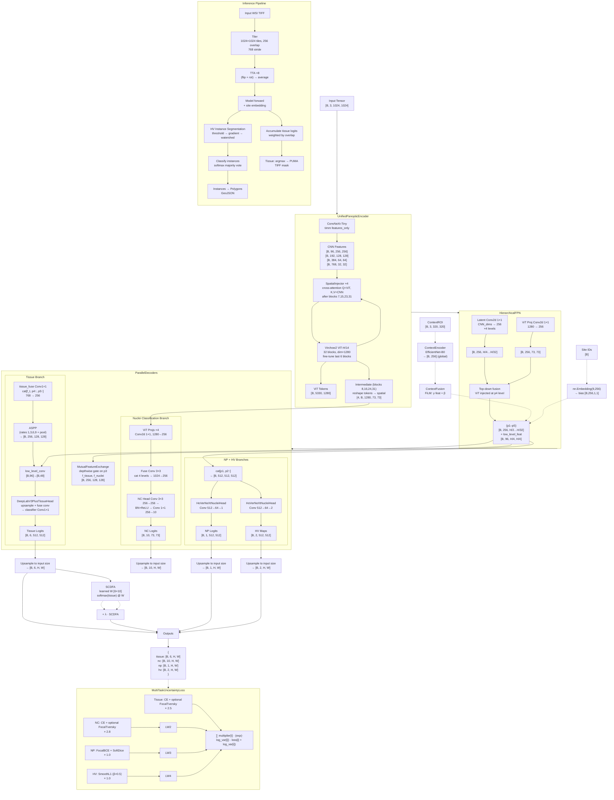

# SymbioPan v9 (CellPath) — Model Architecture

## Legend

- `[B, C, H, W]` — tensor shape (batch, channels, height, width)
- `{ }` — dictionary / named tuple
- `---` — optional path



## Class Hierarchy

```
UnifiedPanopticNet
├── encoder: UnifiedPanopticEncoder
│   ├── vit_model: Virchow2 ViT-H/14    # 32 blocks, dim=1280
│   ├── cnn_model: ConvNeXt-Tiny        # 4 stages, features_only
│   └── bridges: SpatialInjector ×4     # cross-attention ViT←CNN
├── fpn: HierarchicalFPN
│   ├── latent_convs ×4                 # 1×1, CNN_dims→256
│   ├── vit_proj                        # 1×1, 1280→256
│   ├── smooth_convs ×4                 # 3×3, 256→256
│   └── low_level_fuse                  # 1×1, 256→96 + BN + ReLU
├── decoders: ParallelDecoders
│   ├── tissue_proj / nuclei_proj       # 1×1, 256→256
│   ├── exchange: MutualFeatureExchange # gated feature swap
│   ├── tissue_decoder: DeepLabV3PlusTissueHead
│   │   └── aspp: ASPP                  # 4× atrous + pool
│   ├── nc_head: CellViTPlusPlusNucleiDecoder  # 4× ViT proj + fuse
│   ├── np_head: HoVerNeXtNucleiHead    # 512→64→1
│   ├── hv_head: HoVerNeXtNucleiHead    # 512→64→2
│   └── tissue_fuse                     # 1×1, 768→256 + BN + ReLU
├── context_encoder: ContextEncoder     # optional, EfficientNet-B0
├── context_fusion: ContextFusionModule # optional, FiLM
├── site_embed: nn.Embedding(9, 256)    # site conditioning
└── sc_dfa: SCDFA                       # 6×10 weight matrix
```

## Configuration (Stage1Config defaults)

| Parameter | Value | Description |
|-----------|-------|-------------|
| batch_size | auto-detected | 6 (H100), 4 (A100), 2 (V100), 1 (smaller) |
| grad_accum_steps | auto-adjusted | max(2, 12 // bs); effective batch ≈ 12 |
| epochs | 50 | Total training epochs |
| lr | 1e-4 | AdamW learning rate |
| weight_decay | 1e-4 | AdamW weight decay |
| warmup_epochs | 5 | Linear warmup epochs |
| fine_tune_last_n_blocks | 6 | ViT blocks to unfreeze |
| focal_start_epoch | 10 | FocalTversky ramp start |
| focal_full_epoch | 16 | FocalTversky ramp end |
| focal_max_weight | 0.5 | Max FocalTversky weight |
| sc_dfa_start_epoch | 15 | SC-DFA ramp start |
| sc_dfa_full_epoch | 22 | SC-DFA ramp end |
| sc_dfa_max_weight | 0.3 | Max SC-DFA λ |
| compile_model | True | torch.compile on GPU CC ≥ 7.0 |
| use_context_encoder | False | Enable context conditioning |
| use_stain_aug | False | Enable H&E stain augmentation |

## Key Design Decisions

1. **Background included as class 0** — Model predicts 6 tissue classes (0=background, 1=stroma, 2=blood_vessel, 3=tumor, 4=epidermis, 5=necrosis). Background is no longer `ignore_index=255`; it is learned like any other class. Inference output is already in PUMA format (no shift needed).

2. **No boundary branch** — The `BoundaryAttentionModule` was removed. `ParallelDecoders` returns 4 outputs (tissue, np, nc, hv). The boundary loss task has multiplier 0.0.

3. **Rare-class focused** — Weighted sampling (bonus ×8), class-weighted loss, 55% selection score weight on rare dice.

4. **Progressive training** — FocalTversky ramps epochs 10–16; SC-DFA ramps epochs 15–22.

5. **TTA ×8** — 8 geometric transforms (flip + rot) applied, inverse-transformed, averaged during inference.
