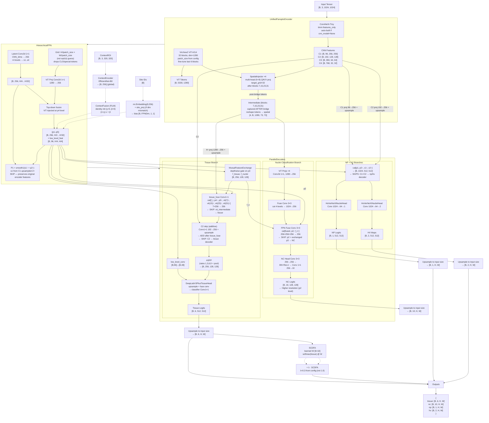

# SymbioPan v9 (CellPath) — Model Architecture

## Legend

- `[B, C, H, W]` — tensor shape (batch, channels, height, width)
- `{ }` — dictionary / named tuple
- `---` — optional path



## Class Hierarchy

```
UnifiedPanopticNet
├── encoder: UnifiedPanopticEncoder
│   ├── vit_model: Virchow2 ViT-H/14    # 32 blocks, dim=1280, patch_size from config
│   ├── cnn_model: ConvNeXt-Tiny        # 4 stages, features_only; auto-built if None
│   └── bridges: SpatialInjector ×4     # multi-head QKV cross-attn, target_grid=32
├── fpn: HierarchicalFPN
│   ├── latent_convs ×4                 # 1×1, CNN_dims→256
│   ├── vit_proj                        # 1×1, 1280→256; grid=H//patch_size
│   ├── smooth_convs ×4                 # 3×3, 256→256
│   └── low_level_fuse                  # 1×1, 256→96 + BN + ReLU
├── decoders: ParallelDecoders
│   ├── tissue_proj / nuclei_proj       # 1×1, 256→256
│   ├── exchange: MutualFeatureExchange # gated feature swap
│   ├── c2_proj_tissue                  # 1×1, 192→256 — SKIP C2→tissue
│   ├── vit_tissue_projs ×4             # 1×1, 1280→256 — SKIP vit→tissue
│   ├── tissue_fuse                     # 1×1, 7×256→256 + BN + ReLU
│   ├── c1_proj_np                      # 1×1, 96→256 — SKIP C1→np/hv
│   ├── c2_proj_np                      # 1×1, 192→256 — SKIP C2→np/hv
│   ├── tissue_decoder: DeepLabV3PlusTissueHead
│   │   └── aspp: ASPP                  # 4× atrous + pool
│   ├── nc_head: CellViTPlusPlusNucleiDecoder
│   │   ├── 4× ViT proj + fuse
│   │   └── fpn_fuse: cat[fused, p2, f_n]  # higher-res NC output at p2 level
│   ├── np_head: HoVerNeXtNucleiHead    # 1024→64→1
│   ├── hv_head: HoVerNeXtNucleiHead    # 1024→64→2
├── context_encoder: ContextEncoder     # optional, EfficientNet-B0
├── context_fusion: ContextFusionModule # optional, FiLM identity init
├── site_embed: nn.Embedding(9, 256)    # site conditioning
├── site_proj: nn.Linear or Identity    # projects embed to match FPN dim
└── sc_dfa: SCDFA                       # 6×10 weight matrix, λ=0.3 default
```

## Configuration (Stage1Config defaults)

| Parameter | Value | Description |
|-----------|-------|-------------|
| batch_size | auto-detected | 6 (H100), 4 (A100), 2 (V100), 1 (smaller) |
| grad_accum_steps | auto-adjusted | max(2, 12 // bs); effective batch ≈ 12 |
| epochs | 50 | Total training epochs |
| lr | 1e-4 | AdamW learning rate |
| weight_decay | 1e-4 | AdamW weight decay |
| warmup_epochs | 5 | Linear warmup epochs |
| virchow2_model_name | paige-ai/Virchow2 | HuggingFace ViT model |
| cnn_backbone | convnext_tiny | timm CNN backbone |
| fine_tune_last_n_blocks | 6 | ViT blocks to unfreeze |
| sc_dfa_lambda | 0.3 | SC-DFA strength (inference) |
| focal_start_epoch | 10 | FocalTversky ramp start |
| focal_full_epoch | 16 | FocalTversky ramp end |
| focal_max_weight | 0.5 | Max FocalTversky weight |
| sc_dfa_start_epoch | 15 | SC-DFA ramp start |
| sc_dfa_full_epoch | 22 | SC-DFA ramp end |
| sc_dfa_max_weight | 0.3 | Max SC-DFA λ during training |
| compile_model | True | torch.compile on GPU CC ≥ 7.0 |
| use_context_encoder | False | Enable context conditioning |
| use_stain_aug | False | Enable H&E stain augmentation |

## Key Design Decisions

1. **Background included as class 0** — Model predicts 6 tissue classes (0=background, 1=stroma, 2=blood_vessel, 3=tumor, 4=epidermis, 5=necrosis). Background is no longer `ignore_index=255`; it is learned like any other class. Inference output is already in PUMA format (no shift needed).

2. **No boundary branch** — The `BoundaryAttentionModule` was removed. `ParallelDecoders` returns 4 outputs (tissue, np, nc, hv). The boundary loss task has multiplier 0.0.

3. **Rare-class focused** — Weighted sampling (bonus ×8), class-weighted loss, 55% selection score weight on rare dice.

4. **Progressive training** — FocalTversky ramps epochs 10–16; SC-DFA ramps epochs 15–22.

5. **TTA ×8** — 8 geometric transforms (flip + rot) applied, inverse-transformed, averaged during inference.

6. **Encoder-decoder skip connections** — Four skip paths improve gradient flow and feature preservation: (1) FPN P1 ← s1 (C1 upsampled), (2) tissue decoder ← C2 additive, (3) tissue decoder ← 4× ViT intermediate features, (4) np/hv decoders ← C1 + C2 projections.

7. **NC high-resolution decoder** — `CellViTPlusPlusNucleiDecoder` fuses ViT features with FPN p2 and exchanged p3 to output nuclei classification logits at 2× higher resolution (p2 level instead of ViT grid).

8. **Multi-head SpatialInjector** — Cross-attention bridges use 8-head Q/K/V projection with `target_grid=32`, reducing CNN token count by 4× vs. `target_grid=64`.

9. **FiLM identity initialization** — Context conditioning starts as identity (γ=0, β=0 → `(1+0)·v+0 = v`), avoiding disruption of pretrained FPN features at warmup.

10. **Auto CNN backbone** — `cnn_model=None` triggers automatic `build_cnn_backbone()`, simplifying the constructor call in both training and inference.
